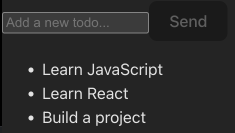

## Todo App Persistent Volumes

### Follow these instructions to run frontend with access to shared persistent volume file.

1. Create Cluster.

   ```bash
   k3d cluster create todo-app-cluster -p 8081:80@loadbalancer --agents 2
   ```

2. Create `/tmp/kube` local path in the node we are binding the Persistent Volume to.

   ```bash
   docker exec k3d-todo-app-cluster-agent-0 mkdir -p /tmp/kube
   ```

3. Apply manifests as defined in `deployment-persistent`, `service`, `persistentvolume`, `persistentvolumeclaim` and `ingress` yaml files from the `todo_app` directory.

   ```bash
   kubectl apply -f manifests
   ```

4. Open http://localhost:8081/ to start FE application. Give it some time. Deployment and pod provisioning can take some time. You can see the new elements, which are the hardcoded todos and the send button:
   

5. Refresh FE at http://localhost:8081/ every 10 minutes and verify the shared volume image changes.

6. To test volume persistance, run the following command to delete our `deployment-persistent` deployment from the `todo_app` directory:

   ```bash
   kubectl delete -f manifests/deployment-persistent.yaml
   ```

7. Recreate the deployment from the `todo_app` directory and confirm it's the same image you saw before taking first deleting it. Allow some time for the deployment to be shown as complete, preferably in Lens:

   ```bash
   kubectl apply -f manifests/deployment-persistent.yaml
   ```
