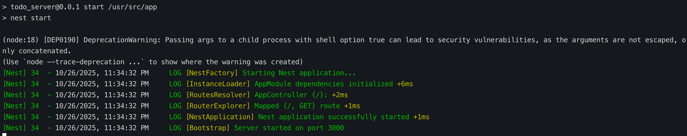

## ToDo Server

### Follow these instructions to run the program

1. Create Cluster.

```bash
k3d cluster create todo-server -a 2
```

2. Switch `kubectl` to use the `k3d-todo-server` context.

```bash
kubectl config use-context k3d-todo-server
```

3. Create `todo-server-dep` deployment with image `javiercoronadonarvaez/todo-server`.

```bash
kubectl create deployment todo-server-dep --image=javiercoronadonarvaez/todo-server
```

4. Confirm pod is existing and available.

```bash
kubectl get pods
```

In my case, the pod's name is `todo-server-dep-689cbdcf4f-w9zqv`

5. See the output by running the following command:

```bash
kubectl logs -f todo-server-dep-689cbdcf4f-w9zqv
```

NOTE:
You can expect the output as a logger statement, as in the following:

```bash
[Nest] 34  - 10/26/2025, 11:34:32 PM     LOG [Bootstrap] Server started on port 3000
```


